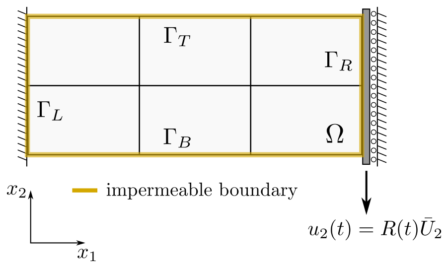
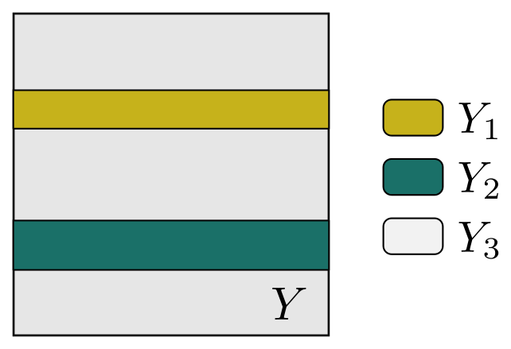
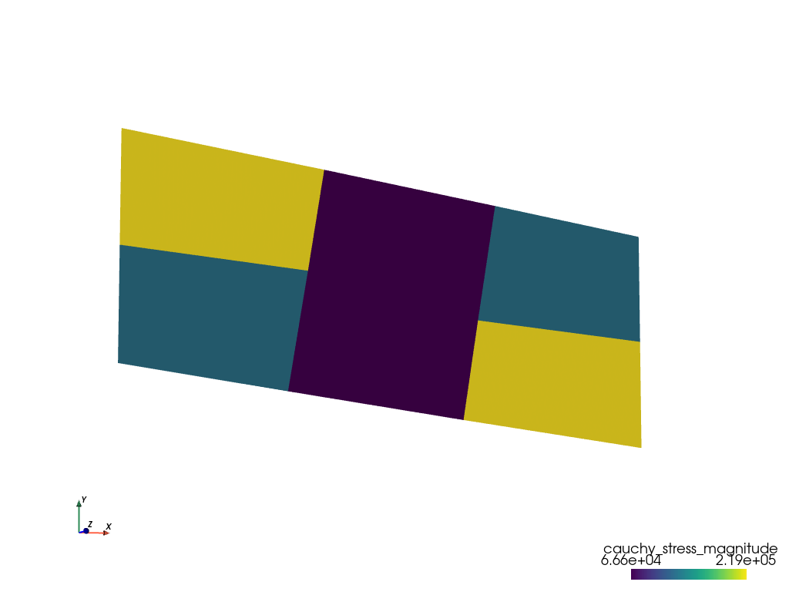

.. toctree::
   :maxdepth: 2
   :caption: Contents:

Two-scale numerical simulation of a large deforming fluid-saturated porous structure
====================================================================================

Mathematical model
------------------

We consider a fluid-saturated porous medium undergoing large deformations. A
double porous medium is constituted by a hyperelastic skeleton and an
incompressible viscous fluid. Within the Eulerian framework related to the
current deformed configuration, the two-scale homogenization approach is
applied to a linearized model discretized in time, being associated with an
incremental formulation. The homogenization procedure of the linearized
equations provides effective (homogenized) material properties which are
computed to constitute the incremental macroscopic problem. The multiscale
model is derived and discussed in [LukesRohan2020]_.

Implementation
--------------

The local subproblems defined within the reference cell and the global
macroscopic equations are discretized and solved by means of the finite element
method. The macroscopic equations and the incremental ULF algorithm are defined
in :code:`largedef_porous_mac.py`. The finite element mesh representing the
macroscopic domain and the applied boundary conditions are depicted in
:numref:`fig_macro`.

.. :code:`macro_mesh_3x2.vtk`

.. _fig_macro:

   Boundary conditions applied to the macroscopic 2D sample.

The local microscopic problems and the homogenized coefficients are specified
in :code:`largedef_porous_mic.py`. The domain, on which the microscopic
calculations are performed, is shown in :numref:`fig_micro`. It consists of the
porous matrix :math:`Y_3` and two fluid channels :math:`Y_1`, :math:`Y_2`.

The macro-micro coupling is governed by the SfePy homogenization engine, see
[CimrmanLukesRohan2019]_, which ensures efficient evaluation of the homogenized
coefficients demanded by the macroscopic simulation.

.. :code:`micro_mesh.vtk`

.. _fig_micro:

   Decomposition of the microscopic domain :math:`Y`.

Running simulation
------------------

To run the multiscale numerical simulation, download the
`archive <https://github.com/sfepy/example_largedef_porous/archive/v1.zip>`_,
unpack it in the main SfePy directory and type:

.. code::

   ./simple.py example_largedef_porous-1/largedef_porous_mac.py

This invokes the time-stepping solver for the problem at the macroscopic level
which calls the homogenization engine evaluating the homogenized coefficients
defined in :code:`largedef_porous_mic.py`. The coefficients are evaluated in
several embedded loops associated with the time steps and the macroscopic
integration points, see [LukesRohan2020]_ for details.

The computed macroscopic results can be visualized using the :code:`resview.py`
post-processing script as follows:

.. code::

   ./resview.py example_largedef_porous/results/macro_mesh_3x2_*.vtk -w u0 -f cauchy_stress:p0 -v "0,0" -s 18

   Distribution of the Cauchy stress magnitude (average values per element) in
   the macroscopic deformed domain at time step 18.

References
----------

.. [LukesRohan2020] Lukeš V. Rohan E.
   Homogenization of large deforming fluid-saturated porous structures
   `arXiv:2012.03730 <https://arxiv.org/abs/2012.03730>`_

.. [CimrmanLukesRohan2019] Cimrman R., Lukeš V., Rohan E.
   Multiscale finite element calculations in Python using SfePy.
   Advances in Computational Mathematics, 45(4):1897-1921, 2019,
   `DOI:10.1007/s10444-019-09666-0 <https://doi.org/10.1007/s10444-019-09666-0>`_
